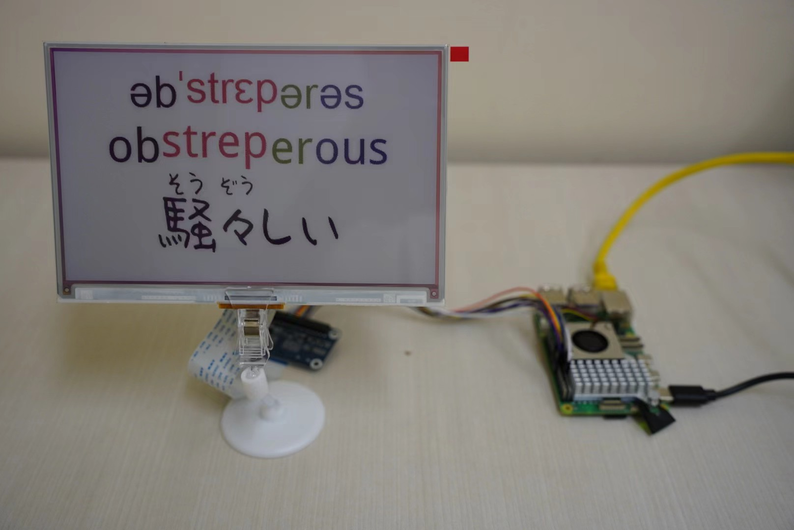

[English](README.md) · [العربية](i18n/README.ar.md) · [Español](i18n/README.es.md) · [Français](i18n/README.fr.md) · [日本語](i18n/README.ja.md) · [한국어](i18n/README.ko.md) · [Tiếng Việt](i18n/README.vi.md) · [中文 (简体)](i18n/README.zh-Hans.md) · [中文（繁體）](i18n/README.zh-Hant.md) · [Deutsch](i18n/README.de.md) · [Русский](i18n/README.ru.md)


[](https://github.com/lachlanchen/lachlanchen/blob/main/figs/banner.png)

# Eink Words GPT

**Language options:** English (this draft)


A Raspberry Pi + Waveshare e-ink project that displays dynamically selected vocabulary with phonetics and multilingual synonyms. The system can fetch words from local datasets or OpenAI, render them into a layout, and push the result to supported e-paper panels. It also exposes a small HTTP service for triggering word updates and retrieving rendered images.

| 🔎 At a Glance | Details |
|---|---|
| Core runtime | `app.py` (HTTP service) + `words_gpt.py` (renderer loop) |
| Data path | CSV datasets in `data/` + SQLite store `words_phonetics.db` |
| Output targets | Waveshare e-paper panels and virtual image outputs |
| AI dependency | Optional (`--enable_openai`) with cache in `cache/` |

## 📚 Table of Contents
- [Overview](#overview)
- [Highlights](#highlights)
- [Quick Start](#quick-start)
- [Demos](#demos)
- [Features](#features)
- [Project Structure](#project-structure)
- [Prerequisites](#prerequisites)
- [Installation](#installation)
- [Configuration](#configuration)
- [Usage](#usage)
- [Examples](#examples)
- [Data, Cache, and Logs](#data-cache-and-logs)
- [Development Notes](#development-notes)
- [Troubleshooting](#troubleshooting)
- [Notes on OpenAI Usage](#notes-on-openai-usage)
- [Roadmap](#roadmap)
- [Support](#-support)
- [Contributing](#contributing)
- [License](#license)

## Overview
`words_gpt` is a Python-based vocabulary card generation and display system for e-ink devices.

It combines:
- Word sourcing from CSV/local datasets and optional OpenAI generation.
- Enrichment (IPA phonetics + multilingual synonym fields).
- Rendering pipelines for hardware and virtual outputs.
- A Tornado HTTP service for remote triggering and image retrieval.

The current codebase centers on `app.py`, `words_gpt.py`, `words_data.py`, `words_database.py`, and `openai_request_json.py`.

## Highlights
- 🖼️ E-ink rendering pipeline with multiple content modes (kanji, Japanese, Arabic, Chinese, emoji).
- 🗃️ Local word database (`words_phonetics.db`) with CSV-backed word lists in `data/`.
- 🤖 OpenAI-backed word selection and phonetic enrichment with structured JSON outputs.
- 🌐 HTTP service for external triggers and image retrieval.
- ⚡ Caching layer (`cache/`) to reduce repeated OpenAI calls.

## Quick Start
| Goal | Command |
|---|---|
| Start HTTP server (port `8082`) | `python app.py` |
| Run standalone renderer (CSV) | `python words_gpt.py --use_csv` |
| Run with OpenAI + CSV | `python words_gpt.py --enable_openai --use_csv` |
| Emoji + simplified CJK mode | `python words_gpt.py --make_emoji --simplify` |
| Raspberry Pi auto setup | `bash scripts/setup_pi_wordscard.sh` |

## Demos
<p align="center">
  
  
</p>

## Features
- Hardware + virtual rendering flow (`EPaperHardware`, `EPaperDisplay`) from `words_gpt.py`.
- Multi-language enrichment pipeline in `words_data.py` (IPA, Japanese variants, Arabic, French, Chinese fields).
- SQLite-backed persistence with dynamic field update helpers in `words_database.py`.
- OpenAI structured JSON request helper with file cache in `openai_request_json.py`.
- Optional PWA assets in `pwa/` for lightweight frontend configuration/preview workflows.

## Project Structure
```text
words_gpt/
├─ README.md
├─ AGENTS.md
├─ app.py
├─ words_gpt.py
├─ words_data.py
├─ words_data_utils.py
├─ words_database.py
├─ openai_request_json.py
├─ env_loader.py
├─ words_update.py
├─ setup.py
├─ epd_7in3f_test.py
├─ epd_13in3k_test.py
├─ words_phonetics.db
├─ word_phonetics_processed.csv
├─ data/
├─ font/
├─ pic/
├─ demos/
├─ figs/
├─ cache/
├─ logs/
├─ logs-word-phonetics/
├─ words_card_temp/
├─ pwa/
├─ scripts/
├─ utilities/
├─ references/
├─ i18n/
└─ waveshare/
```

Important runtime files:
- `app.py`: Tornado web server (default port `8082`) and periodic update loop.
- `words_gpt.py`: Standalone renderer loop and display classes.
- `words_data.py`: Core word fetching/enrichment orchestration.
- `words_database.py`: SQLite store helpers.
- `scripts/*.sh`: Raspberry Pi setup, service install, and tmux lifecycle scripts.

## Prerequisites
- Python `3.9+` (recommended).
- Raspberry Pi target (for hardware mode).
- Supported Waveshare e-paper panel.
- SPI enabled on Pi (`raspi-config`), plus panel-specific wiring.

Python packages used in this project include:
- `openai`, `tornado`, `Pillow`, `numpy`, `nltk`, `opencc`, `pykakasi`, `arabic_reshaper`, `python-bidi`, `pytz`.
- Setup script additionally installs: `json5`, `pandas`, `spidev`, `RPi.GPIO`, `gpiozero`, `lgpio`.

## Installation

### Option A: Minimal/manual install
Install Waveshare driver package:
```bash
python setup.py install
```

If you use the NLTK word list, download once:
```bash
python -m nltk.downloader words
```

### Option B: Raspberry Pi automated setup (recommended on device)
From repo root:
```bash
bash scripts/setup_pi_wordscard.sh
```

This script:
- Installs apt dependencies.
- Ensures SPI is enabled.
- Creates and activates `wordscard` virtual env.
- Installs Python runtime dependencies.
- Installs Waveshare package.
- Starts `app.py` inside a tmux session.

## Configuration

### `.env` behavior
This repo loads environment variables from `.env` at import time and **overrides** any existing shell values. This makes local overrides deterministic even when you already export values in shell profiles.

Create or update `.env`:
```env
OPENAI_API_KEY=sk-your-key-here
OPENAI_ORG_ID=org-your-org-id
OPENAI_MODEL=gpt-4o-mini
```

### App argument passthrough
The systemd/tmux scripts support:
```bash
APP_ARGS="--enable_openai --use_csv" ./scripts/start_wordscard.sh
```

### CLI flags (server and renderer)
Both `app.py` and `words_gpt.py` support:
- `--enable_openai`
- `--make_emoji`
- `--ignore_list`
- `--simplify`
- `--use_csv`
- `--complete_csv`
- `--filename <csv_file>`

## Usage

### Running the HTTP server
Start service (default port `8082`):
```bash
python app.py
```

Observed routes in code:
- `POST /display_word`
- `GET /get_current_word`
- `GET /get_current_word_page`
- `GET /next_random_word`
- `POST /get_words_card`
- `GET /static/(.*)` (from `words_card_temp/`)

Compatibility note: earlier docs referenced `GET /current_word`; current `app.py` route is `GET /get_current_word`.

### Running standalone renderer
CSV-based list:
```bash
python words_gpt.py --use_csv
```

Enable OpenAI:
```bash
python words_gpt.py --enable_openai --use_csv
```

Emoji rendering + simplified CJK:
```bash
python words_gpt.py --make_emoji --simplify
```

### Service mode on Raspberry Pi
Install service unit:
```bash
bash scripts/install_wordscard_service.sh
```

Then:
```bash
sudo systemctl start wordscard
sudo systemctl status wordscard -n 50
journalctl -u wordscard -n 100 --no-pager
```

## Examples

### Trigger next random word
```bash
curl "http://127.0.0.1:8082/next_random_word"
```

### Read current word payload
```bash
curl "http://127.0.0.1:8082/get_current_word"
```

### Submit explicit word
```bash
curl -X POST "http://127.0.0.1:8082/display_word" \
  -H "Content-Type: application/json" \
  -d '{"word":"serendipity"}'
```

### Hardware smoke tests
Use display-specific script:
```bash
python epd_7in3f_test.py
```

Or:
```bash
python epd_13in3k_test.py
```

More examples live in `waveshare/examples/`.

## Data, Cache, and Logs
| Area | Path(s) | Notes |
|---|---|---|
| Word lists | `data/` | Includes `data/words_list.csv` and themed CSV files |
| Persistent DB | `words_phonetics.db` | Local phonetics/enrichment store |
| OpenAI/cache artifacts | `cache/` | Reduces repeated requests |
| Logs | `logs/`, `logs-word-phonetics/` | Runtime and update logs |
| Generated cards | `words_card_temp/` | Image outputs and static serving source |

## Development Notes
- Dependency management is script-first (`scripts/setup_pi_wordscard.sh`) + `setup.py`; there is no `requirements.txt` or `pyproject.toml` yet.
- Multiple backup/legacy files exist (`words_data_*`, `words_gpt_old.py`); active runtime path is primarily `app.py` + `words_gpt.py` + `words_data.py` + `words_database.py`.
- `env_loader.py` always overwrites environment variables from `.env` when keys are present.
- Server mode runs a periodic refresh flow (every ~5 minutes) that can call the update endpoint internally.

## Troubleshooting
- `ModuleNotFoundError` or import issues:
  - Ensure virtual environment is active and dependencies are installed.
  - Re-run `bash scripts/setup_pi_wordscard.sh` on Pi.
- OpenAI errors (`401`, missing model/key):
  - Verify `OPENAI_API_KEY` and optional `OPENAI_MODEL` in `.env`.
  - Confirm network connectivity from device.
- Display not updating:
  - Verify panel model/wiring and run matching test script (`epd_7in3f_test.py` or `epd_13in3k_test.py`).
  - Confirm SPI is enabled (`sudo raspi-config nonint do_spi 0`).
  - On Pi 5, ensure `/dev/spidev0.0` compatibility symlink if device exposes `/dev/spidev10.0`.
- OpenCC install issues:
  - Use distro-compatible package (`libopencc1` or `libopencc2`) as done in setup script.
- API route mismatch:
  - Use `/get_current_word` for current payload, not `/current_word`.

## Notes on OpenAI Usage
OpenAI access is optional but recommended for fresh word generation and phonetic enrichment. The structured JSON helper in `openai_request_json.py` caches results under `cache/` to reduce repeated calls.

## Roadmap
- Add formal dependency manifest (`requirements.txt` or `pyproject.toml`) for reproducible installs.
- Expand `i18n/` with maintained translated README variants.
- Consolidate legacy/backup script variants after canonical flow is finalized.
- Document the PWA workflow (`pwa/`) with endpoint examples and screenshots.
- Add repeatable automated tests for data and route-level behavior.

## ❤️ Support

If this project is useful to you, these links directly support ongoing maintenance and hardware iteration.

| Donate | PayPal | Stripe |
|---|---|---|
| [](https://chat.lazying.art/donate) | [](https://paypal.me/RongzhouChen) | [](https://buy.stripe.com/aFadR8gIaflgfQV6T4fw400) |

### What your support makes possible
- <b>Keep tools open</b>: hosting, inference, data storage, and community ops.  
- <b>Ship faster</b>: focused open-source time on WordsCardEink and related learning tools.  
- <b>Prototype devices</b>: e-ink hardware iterations and display layout research.  
- <b>Access for all</b>: subsidized deployments for students, creators, and community groups.

### Donate

<div align="center">
<table style="margin:0 auto; text-align:center; border-collapse:collapse;">
  <tr>
    <td style="text-align:center; vertical-align:middle; padding:6px 12px;">
      <a href="https://chat.lazying.art/donate">https://chat.lazying.art/donate</a>
    </td>
    <td style="text-align:center; vertical-align:middle; padding:6px 12px;">
      <a href="https://chat.lazying.art/donate"></a>
    </td>
  </tr>
  <tr>
    <td style="text-align:center; vertical-align:middle; padding:6px 12px;">
      <a href="https://paypal.me/RongzhouChen">
        
      </a>
    </td>
    <td style="text-align:center; vertical-align:middle; padding:6px 12px;">
      <a href="https://buy.stripe.com/aFadR8gIaflgfQV6T4fw400">
        
      </a>
    </td>
  </tr>
  <tr>
    <td style="text-align:center; vertical-align:middle; padding:6px 12px;"><strong>WeChat</strong></td>
    <td style="text-align:center; vertical-align:middle; padding:6px 12px;"><strong>Alipay</strong></td>
  </tr>
  <tr>
    <td style="text-align:center; vertical-align:middle; padding:6px 12px;"></td>
    <td style="text-align:center; vertical-align:middle; padding:6px 12px;"></td>
  </tr>
</table>
</div>

**支援 / Donate**

- ご支援は研究・開発と運用の継続に役立ち、より多くのオープンなプロジェクトを皆さんに届ける力になります。  
- 你的支持将用于研发与运维，帮助我持续公开分享更多项目与改进。  
- Your support sustains my research, development, and ops so I can keep sharing more open projects and improvements.

## Contributing
See `AGENTS.md` for contributor guidelines, coding style, and PR expectations.

Suggested contribution checklist:
- Include panel model + hardware notes for display changes.
- List exact commands run for validation.
- Attach screenshots/photos for UI or e-ink output changes.
- Describe dataset edits (file + row/column impact).

## License
No `LICENSE` file is currently present in the repository root (observed in this draft pass). Until a license file is added, reuse rights are not explicitly granted.

Assumption: maintainers may add an explicit open-source license in a follow-up update.
